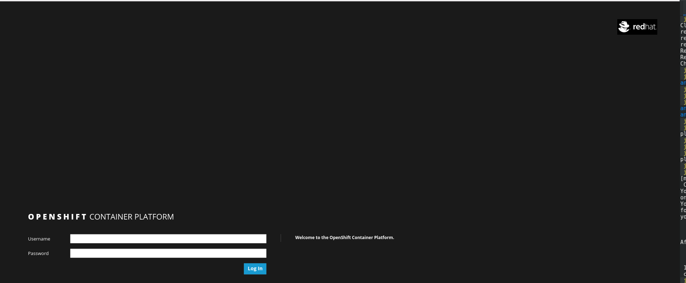

Ansible Playbook: Openshift Custom Login Page
=========

This playbook contains Jooho.image-resize and Jooho.openshift_custom_login_page.
It resizes an image to fit for logo accordingly for openshift custom login page. 

Refer this [doc](https://goo.gl/2L45bJ)

Requirements
------------
None

Dependencies
------------

- [Jooho.image-resize](https://galaxy.ansible.com/Jooho/image-resize/)
- [Jooho.openshift-custom-login-page](https://galaxy.ansible.com/Jooho/openshift-custom-login-page/)

Roles Variables
--------------

| Name                      | Default value                         |        Requird       | Description                                                                 |
|---------------------------|---------------------------------------|----------------------|-----------------------------------------------------------------------------|
| openshift_master_conf_dir | /etc/origin/master                    |         no           | Where openshift configuation dir is                                         |
| master_url                | http://master1.example.com:8443       |         no           | API Server URL                                                              |
| login_html_dir            | /etc/origin/master                    |         no           | Where new login html page will locate                                       |
| temp_dir                  | /tmp                                  |         no           | Temp directory                                                              |
| input_img                 | sample-openshift-ori.png              |         no           | Original Image InputPath                                                    |
| size                      | 193x144                               |         no           | Resized Image Size                                                          |
| overwrite_force           | true                                  |         no           | If true, it overwrite exist resized image

**NOTE**
If you want to use different vars from default one, you should specify them with -e options

Example Execute Commands
-----------------------

- **Download roles**
~~~
cd openshift-toolkit/ansible-playbook-openshift-custom-login-logo

ansible-galaxy install -f -r requirements.yaml -p ./roles
~~~

- **Use default logo**

*Options:*
  - If you don't use root user, you need to add `-b` (=sudo)
  - If you want to restart master manually, please add `-e restart_master=false`
  - If you want to use your own image, please add `-e input_img=/path/to/logo.png`

~~~
ansible-playbook -i /path/to/hosts ./playbook.yaml                           

or 

ansible-playbook -i /path/to/hosts  -b ./playbook.yaml    #(if ansible_ssh_user is not root)
~~~

- **Use your own logo**
~~~
ansible-playbook -i /path/to/hosts  ./playbook.yaml -e input_img=/path/to/logo.png

or 

ansible-playbook -i /path/to/hosts  -b ./playbook.yaml -e input_img=/path/to/logo.png    #(if ansible_ssh_user is not root)
~~~

Sample Hosts file
------------------

```
[masters]
dhcp1-1.gsslab.rdu2.redhat.com

[etcd]
dhcp1-1.gsslab.rdu2.redhat.com

[nodes]
dhcp1-1.gsslab.rdu2.redhat.com openshift_node_labels="{'region': 'mgmt', 'role': 'master'}"
dhcp1-2.gsslab.rdu2.redhat.com openshift_node_labels="{'region': 'infra', 'role': 'app', 'zone': 'default'}"
dhcp1-3.gsslab.rdu2.redhat.com openshift_node_labels="{'region': 'infra', 'role': 'app', 'zone': 'default'}"
```

Video Clip
----------
[](https://asciinema.org/a/144986)


Result Image
------------


License
-------

BSD/MIT

Author Information
------------------

This role was created in 2016 by [Jooho Lee](http://github.com/jooho).

