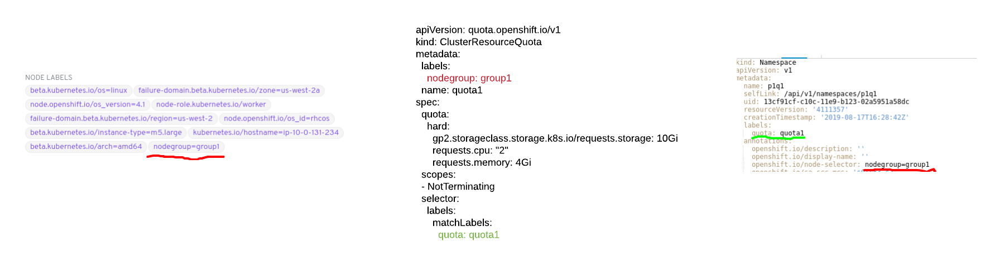
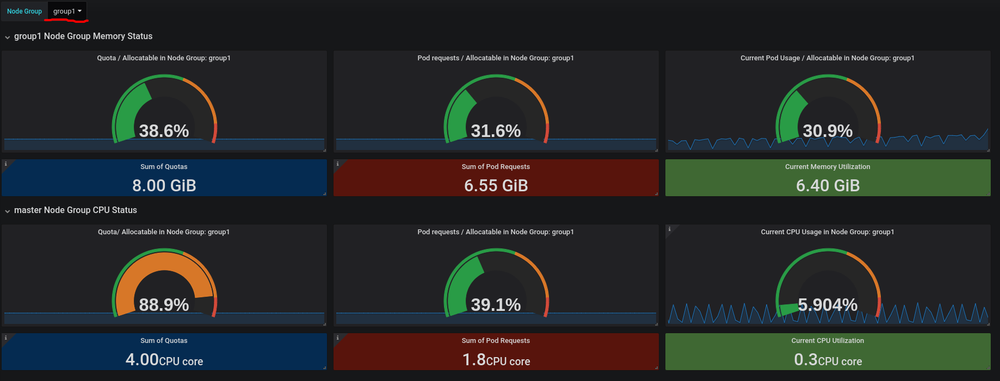

# Capacity Management Dashboard

This repo adds a capacity management Grafana dashboard.
The intent of this dashboard is to answer a single question: Do I need a new node?

We believe this is the most important question when setting up a capacity management process. We are aware that this is not the only question a capacity management process may need to be able to answer. Thus, this should be considered as the starting point for organizations to build their capacity management process.

OCP 4.x introduces cluster autoscaler, do we still need a capacity management process? Yes, certainly for those implementations where an autoscaler cannot be used. Even when autoscaler is available, having a dashboard that presents the current situation can be useful.

## Assumptions

In order for this dashboard to present meaningful information, the following assumptions must be observed:

1. The cluster nodes are grouped into non overlapping groups. Groups are identified by a label. The default for the label is `nodegroup`. Each node should belong to exactly one group. The capacity management dashboard will tell us if we need to add a node to a specific group. Groups can be used to manage zones or areas of the cluster that house different workloads and may need to scale independently. For example in 3.x there are always 3 groups: master, infranodes and worker nodes. Worker nodes can be fragmented further if needed. In OCP 4.x we don't necessarily have infranodes anymore but the same concepts apply.

2. We use ClusterResourceQuota to limit the amount of resources a tenant of the cluster can request. We assume that ClusterResourceQuota works best for most customers because it allows for a flexible granularity of what is under quota (project, app with all SDLC environments, a business capability (sets of apps), a line of business (sets of business capabilities)). This allows a flexible showback/chargeback model. Multiple projects can be controlled by a ClusterResourceQuota. Quotas must be defined for CPU and memory requests. Other resources can be put under quotas but they will be ignored by this dashboard.

3. Each defined ClusterResourceQuota refers to exactly one node group. ClusterResourceQuota objects must be labeled with the same label as the nodegroup they refer to in order to allow for the dashboard PromQL queries to work.

4. Each tenant project must be controlled by exactly one cluster resource quota. System projects can be left without a quota. Each tenant project must have a default node selector configured to select the nodegroup associated with the ClusterResourceQuota it refers to.

To help visualize this setup, you can think of it as the following ER relationship:

`Node -N:1-> NodeGroup <-1:N- ClusterResourceQuota <-1:N- Projects/Namespaces`



How to set up this configuration is out of scope of this guide. We recommend instrumenting the application onboarding process to automate the necessary configuration for the OpenShift quotas and projects that are created. On the infrastructure side there should be automation to set up the nodes with the correct labels.

Refer to the [example](./example/README.md) to see how to meet the prerequisites.

## Dashboard

Here is an example of what the dashboard looks like:



The concepts are the same for memory and CPU. Given a node group (selected from the drop down list box) the dashboard provides the following panels:

1. Ratio between sum of quotas and allocatable. This represents what we have promised in terms of quotas for the given node group versus what is actually available.
2. Ratio between sum of requests and allocatable. This represents what the developers estimate they need versus what is actually available.
3. Ratio between current usage and allocatable. This represent what is actually being used versus what we actually have.

Let's analyze each panel separately:

### Interpreting the current usage panel

Current usage is a highly volatile metric that varies by the second based on volumes of requests on the running applications. It is not suitable for making load predictions nor deciding on whether the cluster should scale. Nonetheless this metric is included in the capacity management dashboard for two reasons:

1. Having this metric allows knowing at glance if we are running out of capacity for the actual used resources. Notice that we cannot use this metric for monitoring the capacity of the individual nodes. This metric averages the nodes, so even if the metric looks healthy, we may have a node that is running out of capacity. Other means must be used to monitor the health of the nodes.
2. If this metric diverges significantly from the sum of requests metric, our developers are poorly estimating resource utilization of their work loads. To fix the issue one should dig deeper, maybe with an additional dashboard, to discover which pods are responsible for the divergence and have the developers that own those nodes fix the requests for those pods.

### Interpreting the request vs allocatable ratio panel

This ratio shows what is being requested (estimates of what we need) versus what the node group has. Assuming we have good estimates, this is a much better signal to scale upon because it's less volatile (it changes only when pods are added/removed). With some approximation, this is also the signal autoscaler, assuming you have configured you machinesets to correspond with nodegroups. But contrary to autoscaler, which is very reactive and will add a new node only when a new pod would make the ratio exceed 100%, we can be more proactive using this panel and decide to scale when a certain percentage of the resources are being requested. Using this metric for scaling the cluster works well when we can provision a new node relatively quickly, for example when nodes are VMs.

### Interpreting the quota vs allocatable ratio panel

This ratio shows what we have promised we can give in terms of resources versus what we have. This is a slow moving ratio because it changes only when new quotas are granted, which should more or less coincide with new teams being onboarded to the cluster. This metric can be used to make long term (and therefore non-precise) forecasts of what is going to be needed. This metric is best utilized when our node provisioning lifecycle is very long, think weeks or months. This likely happens when the nodes are physical machines.
This ratio can possibly go above 100%. In that situation the cluster is overcommitted. Overcommitting the cluster is generally fine if we can safely assume that not all projects will use all of the resources described by their quotas at the same time. Each organization will have to find its own sweet spot in terms of overcommitting the cluster.

## Applier-based installation

Install as follows on 4.x:

```shell
git clone https://github.com/redhat-cop/openshift-toolkit
cd openshift-toolkit/custom-dashboards
ansible-galaxy install -r requirements.yml -p galaxy
ansible-playbook -i .applier/ galaxy/openshift-applier/playbooks/openshift-cluster-seed.yml \
  -e include_tags="dashboard-capacity,openshift-4"
```

Install as follows on 3.x:

```shell
git clone https://github.com/redhat-cop/openshift-toolkit
cd openshift-toolkit/custom-dashboards
ansible-galaxy install -r requirements.yml -p galaxy
ansible-playbook -i .applier/ galaxy/openshift-applier/playbooks/openshift-cluster-seed.yml \
  -e include_tags="dashboard-capacity,openshift-3"
```

## Alternative Installation method

Install the openshift-state-metrics additional metrics here as follows:

```shell
git clone https://github.com/openshift/openshift-state-metrics
cd openshift-state-metrics
oc apply -f ./manifests
```

Install the custom dashboard as follows:

```shell
git clone https://github.com/redhat-cop/openshift-toolkit
oc apply -f openshift-toolkit/custom-dashboards/.openshift/manifests -n openshift-monitoring
```

Import the dashboard by opening Grafana and importing the capacity planning dashboard: [capacity-planning.json](./capacity-planning.json). If you are installing on a 3.x cluster, use this dashboard [capacity-planning-3.11.json](./capacity-planning-3.11.json).
