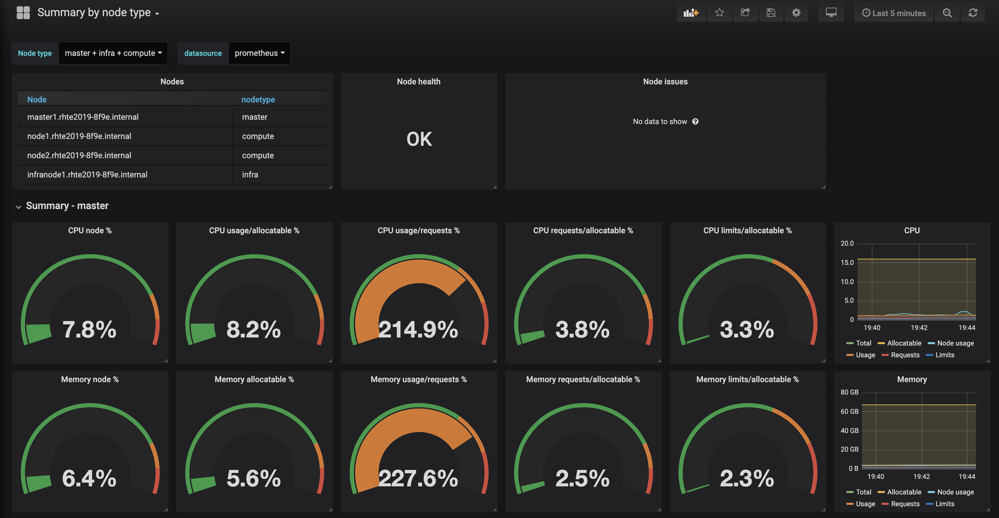
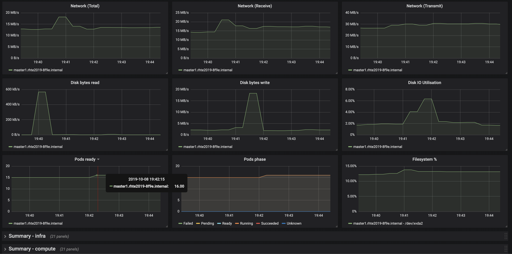
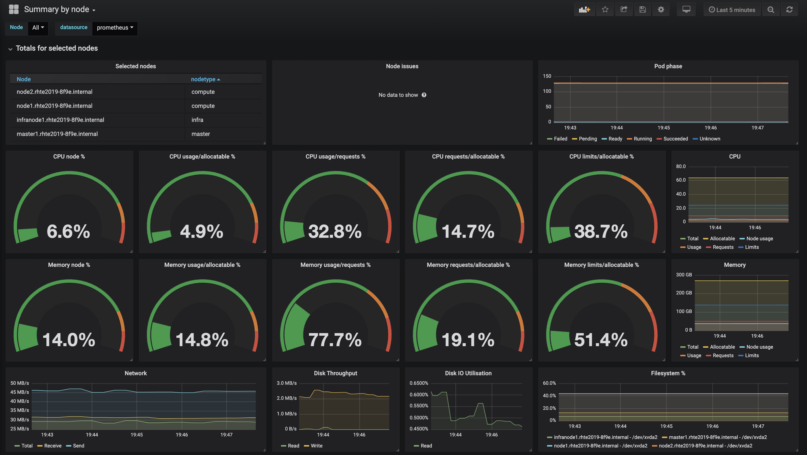
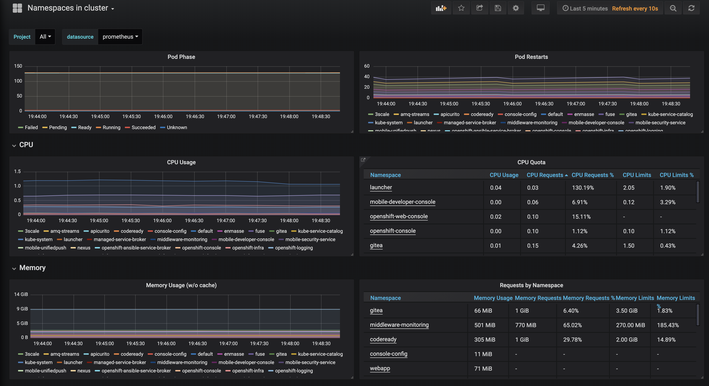
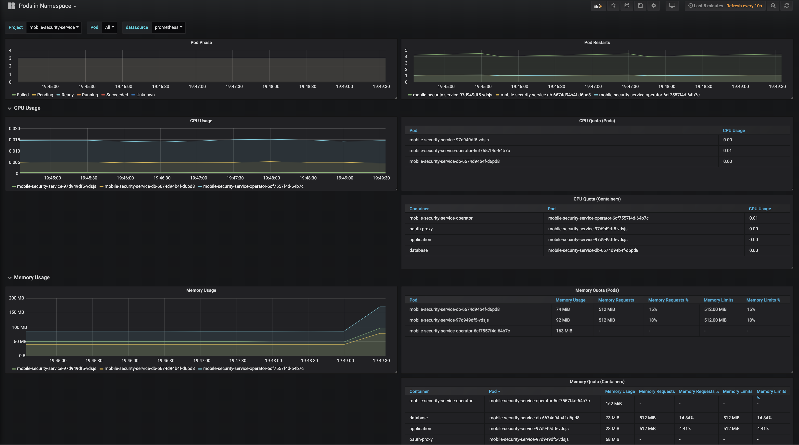

# Custom Grafana dashboards for OpenShift v3.11

## Summary by nodetype
Shows summary metrics for all three nodetypes (master, infra, compute). Different type of nodes run different type of workloads, so it’s useful to monitor resource utilization grouped this way (e.g. How much memory do I have to run application pods?). 

Top panels:
* Nodes
* Node health
* Node issues

Repeated panels:
* CPU node %
* CPU usage/allocatable %
* CPU usage/request %
* CPU request/allocatable %
* CPU limits/allocatable %
* CPU graph: Total, Allocatable, Node usage, Usage, Request, Limits
* Memory node %
* Memory usage/allocatable %
* Memory usage/request %
* Memory request/allocatable %
* Memory limits/allocatable %
* Memory graph: Total, Allocatable, Node usage, Usage, Request, Limits
* Network Total: receive+transmit
* Network Receive
* Network Transmit
* Disk bytes read
* Disk bytes write
* Disk IO Utilization
* Filesystem %
* Pods per node
* Pod phase

This panel only works if the standard OpenShift labels are used on the nodes (e.g. _node-role.kubernetes.io/compute=true_). By default it shows _master_, _infra_ and _compute_ node groups, but if additional node roles exist, you simply have to add them to the list in _$nodetype_ dasboard variable.

## Summary by nodetype

The dashboard have two sections:
* Summary resource utilization including all selected nodes
* Resource utilization for each selected node on-by-one (repeated row)

The panels are more or less the same as on _Summary by nodetype_.

## Namespaces in cluster

One or multiple projects within the cluster can be selected. Values are calculated for the selected projects. This dashboard is a customized version of the default _Kubernetes / Compute Resources / Cluster_ dashboard in OpenShift v3.11. 

Panels:
* Pod phase
* Pod restarts
* CPU Usage
* CPU Quota: Clinking on namespace name opens the _Pods in Namespace_ dashboard
* Memory Usage
* Memory Quota: Clinking on namespace name opens the _Pods in Namespace_ dashboard

## Pods in namespace
One namespace and one or multiple pods within the namespace can be selected. Values are calculated for the selected pods. This dashboard is a customized version of the default _Kubernetes / Compute Resources / Namespace (Pods)_ dashboard in OpenShift v3.11.

Panels:
* Pod Phase
* Pod Restarts
* CPU Usage
* CPU Quota (Pods)
* CPU Quota (Container)
* Memory Usage
* Memory Quota (Pods)
* Memory Quota (containers)

 Limits and requests are set per container, the pod level metrics are simply the summary of container metrics belonging to the pod. When one container in a pod has limits set, but the other does not, the pod level _usage_ can be more than the _limits_ which looks a bit strange first. Taking a look at the the container level table clarifies what we see on the pod level.

 